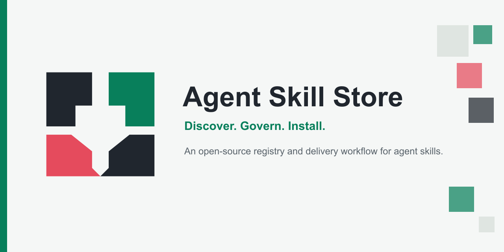
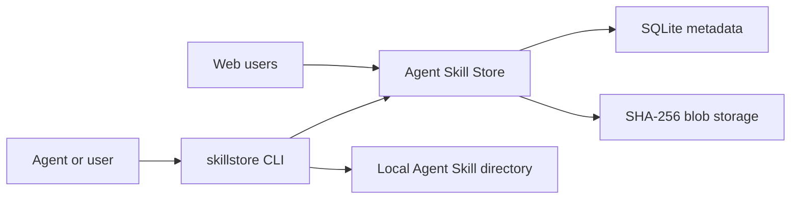

# Agent Skill Store



**Discover. Govern. Install.**

Agent Skill Store is a self-hosted catalog, governance console, API, and CLI for AI agent skills. Teams can publish versioned Skill packages, review them independently, expose approved releases for public discovery, and install them locally with `skillstore`.

[中文说明](README.zh-CN.md) | [Security](SECURITY.md) | [Contributing](CONTRIBUTING.md) | [Upstream attribution](UPSTREAM.md)

## What It Provides

- Public Skill discovery through the web UI, REST API, RFC index, and native manifest.
- Governed uploads with package validation, risk metadata, review, approval, and audit history.
- Versioned artifacts backed by SQLite and SHA-256 content-addressed blob storage.
- A local CLI for discovery, installation, update, uninstall, rollback, publishing, and API Key management.
- Local role accounts for authors, reviewers, engineers, and platform administrators.
- A typed AOT-compatible .NET client package.

The server never runs a Skill or writes into an Agent's local directories. Installation happens on the user's machine when the user or Agent invokes `skillstore`.

## Requirements

- .NET SDK `10.0.203`
- Node.js `24`
- npm

## Quick Start

Build the web application:

```bash
cd web
npm ci
npm run build
cd ..
```

Generate a bootstrap management key offline:

```bash
dotnet run --project src/AgentSkillStore.Cli -- api-key generate
```

Set the returned key and start the server on the local development port:

```bash
export ASPNETCORE_ENVIRONMENT=Development
export ASPNETCORE_URLS=http://0.0.0.0:8081
export AGENTSKILLSTORE__DATAPATH="$PWD/data"
export AGENTSKILLSTORE__BASEURL=http://127.0.0.1:8081
export AGENTSKILLSTORE__BOOTSTRAPAPIKEY='<generated-key>'

dotnet restore src/AgentSkillStore.Server/AgentSkillStore.Server.csproj
dotnet run --project src/AgentSkillStore.Server -c Release
```

Open [http://localhost:8081](http://localhost:8081).

Development accounts:

| Role | Username | Password |
| --- | --- | --- |
| Platform administrator | `admin` | `admin` |
| Skill author | `author` | `author` |
| Skill reviewer | `reviewer` | `reviewer` |
| Engineer | `engineer` | `engineer` |

These accounts are loaded only in the Development environment. Production startup requires explicitly configured users and rejects local passwords shorter than 12 characters.

## CLI

Install the local project as a .NET tool package after packing it:

```bash
dotnet pack src/AgentSkillStore.Cli/AgentSkillStore.Cli.csproj -c Release -o artifacts/nuget
dotnet tool install --global --add-source artifacts/nuget AgentSkillStore.Cli --version 0.1.0
```

Configure a server and an Agent Key:

```bash
skillstore login --server http://localhost:8081 --api-key '<key>'
skillstore list
skillstore install engineering/code-review-checklist@2.1.0 --target codex
```

The CLI reads:

- `AGENT_SKILL_STORE_URL`
- `AGENT_SKILL_STORE_API_KEY`
- `~/.agent-skill-store/config.json`

See [docs/CLI.md](docs/CLI.md) for the full command reference.

## API Key Bootstrap

`skillstore api-key generate` creates a random Bootstrap Key entirely offline. On first startup, set it through `AGENTSKILLSTORE__BOOTSTRAPAPIKEY`.

The server:

- imports the key only when the key store is empty;
- stores only its SHA-256 hash;
- grants `skills:read skills:submit keys:manage`;
- never returns the bootstrap key from an API;
- refuses anonymous creation of the first management key;
- refuses to revoke the last unexpired `keys:manage` key.

Use the bootstrap credential to create ordinary Agent Keys:

```bash
export AGENT_SKILL_STORE_URL=http://localhost:8081
export AGENT_SKILL_STORE_API_KEY='<bootstrap-key>'

skillstore api-key create --label 'Build Agent'
skillstore api-key list
```

Raw keys are returned once. Store them in a secret manager and do not place them in source control or logs.

## Architecture

| Project | Responsibility |
| --- | --- |
| `src/AgentSkillStore.Server` | ASP.NET Core server, web UI, governance APIs, SQLite, blobs |
| `src/AgentSkillStore.Client` | Typed .NET client |
| `src/AgentSkillStore.Cli` | `skillstore` local CLI |
| `src/AgentSkillStore.AppHost` | Aspire development host |
| `web` | React and TypeScript console |
| `tests` | Unit, integration, CLI, and Playwright E2E tests |



## Public Discovery

| Endpoint | Purpose |
| --- | --- |
| `GET /.well-known/agent-skills/index.json` | Agent Skills discovery index |
| `GET /manifest.json` | Native versioned manifest |
| `GET /api/v1/skills` | Public Skill listing and search |
| `GET /api/v1/skills/{name}/{version}/archive.zip` | Approved install artifact |
| `GET /health` | Health check |

Governed publishing and administration use `/api/enterprise/v1`. Legacy direct publishing is disabled by default.

## Docker

```bash
export AGENT_SKILL_STORE_BASEURL=https://skills.example.com
export AGENT_SKILL_STORE_ADMIN_PASSWORD='replace-with-a-strong-password'
export AGENT_SKILL_STORE_BOOTSTRAP_API_KEY='<generated-key>'
docker compose -f docker/docker-compose.yml up --build
```

The container listens on `8080`; the provided Compose file publishes it on host port `8081`.

## Development Checks

```bash
cd web && npm ci && npm test && npm run typecheck && npm run build && cd ..
dotnet restore AgentSkillStore.slnx
dotnet build AgentSkillStore.slnx -c Release --no-restore
dotnet test AgentSkillStore.slnx -c Release --no-build
```

See [docs/TOOLING.md](docs/TOOLING.md) for packaging, E2E, and container checks.

## Release Status

`v0.1.0` produces local release artifacts for four CLI platforms, NuGet packages, OCI container archives, and `SHA256SUMS`. The first release does not publish to NuGet.org or GHCR automatically.

## License

Licensed under Apache-2.0. See [LICENSE](LICENSE), [NOTICE](NOTICE), and [UPSTREAM.md](UPSTREAM.md).
